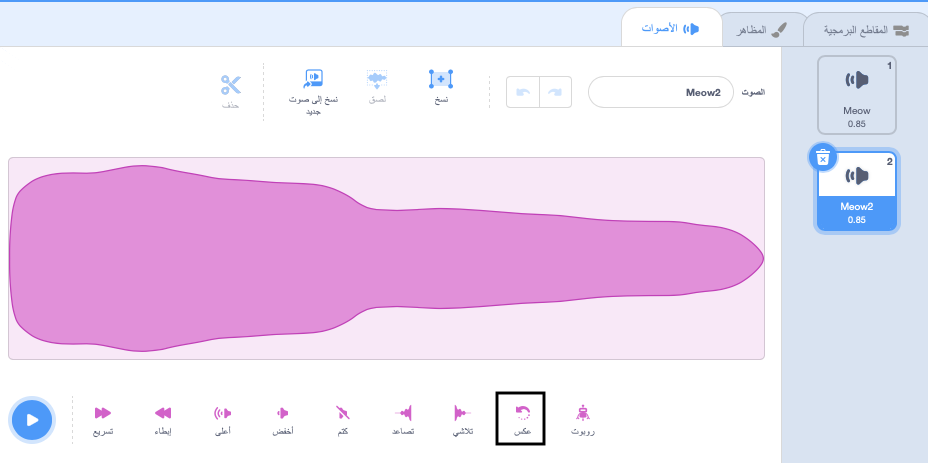
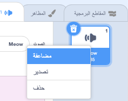

تُعد عكس الاصوات مفيدة لإنشاء مؤثرات خاصة ، على سبيل المثال صوت الــ ، `Slide whistle` يُحدث تأثير انكماش جيد ، لذا فإن عكسه يجعل تأثير النمو مثالي!

قم بإضافة أو تسجيل صوت.

انقر على **عكس** لتشغيل الصوت بشكل عكسي. سترى انعكاس الموجة الصوتية.

**نصيحة:** للاحتفاظ بكل من الإصدار الأصلي والإصدار المعكوس من الصوت ، انقر بزر الماوس الأيمن (أو انقر مع الاستمرار) على الصوت الأصلي واختر "مضاعفة".

