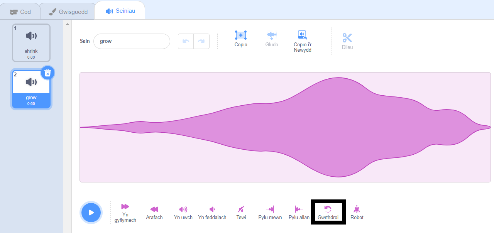
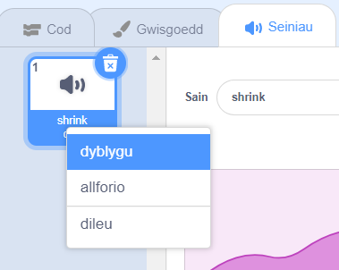

Mae gwrthdroi sain yn ddefnyddiol ar gyfer creu effeithiau arbennig. Er enghraifft, mae'r sŵn `Chwiban llithr` yn creu'r argraff bod rhywbeth yn mynd yn llai, ond mae troi'r sŵn o chwith yn creu'r argraff ei fod yn mynd yn fwy!

Ychwanegu neu recordio sain.

Clicia ar **Gwrthdroi** i wneud i'r sain chwarae am yn ôl. Bydd y donfedd yn troi o chwith.

**Awgrym:** I gadw'r fersiwn wreiddiol a fersiwn gwrthdroi'r sain, de-glicia (neu tap a dal) y sain gwreiddiol a dewis 'dyblygu'.

