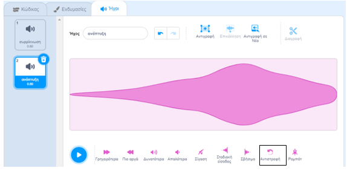

Η αντιστροφή ήχων είναι χρήσιμη για τη δημιουργία ειδικών εφέ, για παράδειγμα ο ήχος `Slide whistle` δημιουργεί ένα καλό εφέ συρρίκνωσης, επομένως η αντιστροφή κάνει το τέλειο εφέ ανάπτυξης!

Πρόσθεσε ή ηχογράφησε έναν ήχο.

Κάνε κλικ στο εικονίδιο **Αντιστροφή** για να αναπαράγεις τον ήχο προς τα πίσω. Θα δεις το ηχητικό κύμα να αντιστρέφεται.

**Συμβουλή:** Για να διατηρήσεις τόσο την αρχική έκδοση όσο και την αντεστραμένη έκδοση του ήχου, κάνε δεξί κλικ (ή πάτησε παρατεταμένα) στον αρχικό ήχο και επέλεξε «διπλασιασμός».

