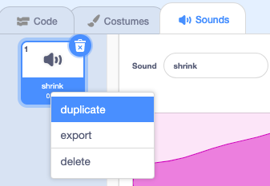

Reversing sounds are useful for creating special effects, for example the `Slide whistle` sound makes a good shrinking effect, so reversing it makes the perfect growing effect! 

Add or record a sound. 

Click on the **Reverse** icon to make the sound play backwards. You will see the sound wave reverse. 

**Tip:** To keep both the original version and the reversed version of the sound, right-click (or tap and hold) on the original sound and choose ‘duplicate’.

