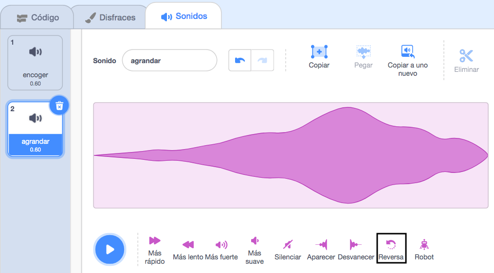
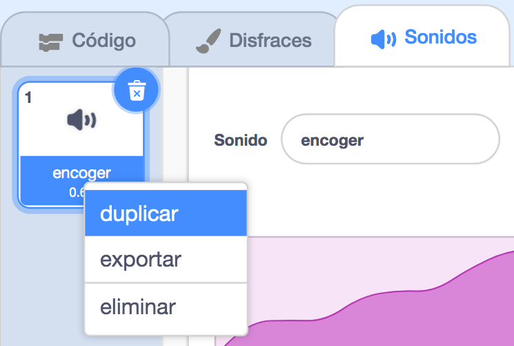

Invertir sonidos es útil para crear efectos especiales, por ejemplo, el sonido de la `Flauta de émbolo` hace un buen efecto de encogimiento, ¡por lo que invertirlo hace un efecto de agrandamiento perfecto!

Agrega o graba un sonido.

Haz clic en el icono **Invertir** para que el sonido se reproduzca al revés. Verás que la onda de sonido se invierte.

**Consejo:** Para mantener tanto la versión original como la versión invertida del sonido, haz clic derecho (o en una tableta, toca y mantén presionado) en el sonido original y elige 'duplicar'.

