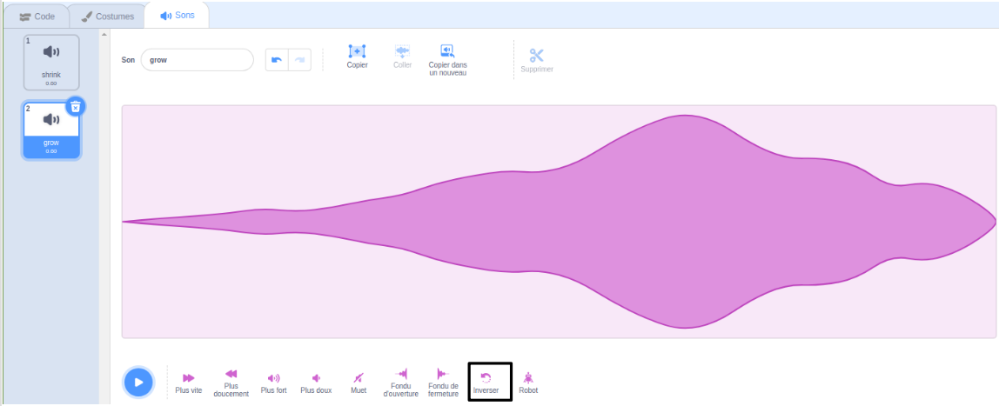
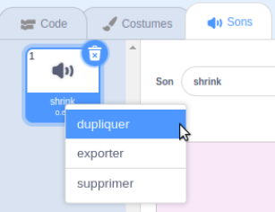

L'inversion des sons sont utiles pour créer des effets spéciaux, par exemple le son `Slide sifflet` produit un bon effet de rétrécissement, donc l'inverser donne l'effet de croissance parfait !

Ajouter ou enregistrer un son.

Clique sur l'icone **Inverser** pour faire jouer le son à l'envers. Tu verras l'onde sonore s'inverser.

**Astuce :** Pour conserver à la fois la version originale et la version inversée du son, fais un clic droit (ou appuie longuement) sur le son original et choisis « dupliquer ».

