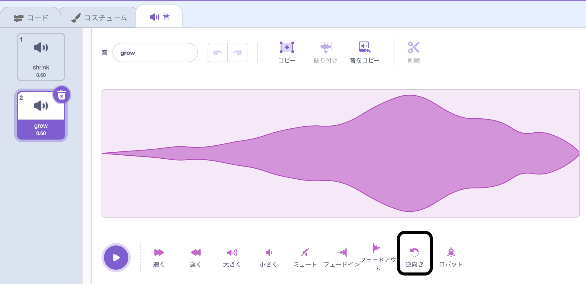
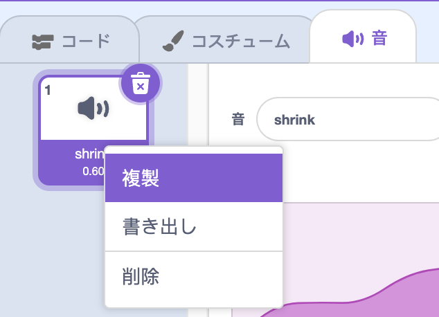

音を反転させると変わった音を作ることができます。 例えば`Slide whistle`は音が小さくなる効果の例で、反転させると音が大きくなる面白い効果になります！

音の追加または録音。

**逆向き**をクリックして逆再生の音を作りましょう。 音波が見えるはずです。

**Tip:**はオリジナルのバージョンと反転したバージョンの両方をキープするには、オリジナルのサウンドを右クリック（またはタップするか、長押し）で「複製」を選択します。

