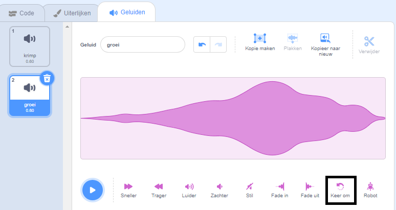
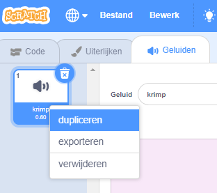

Omgekeerde geluiden zijn handig voor het creëren van speciale effecten, bijvoorbeeld het `Slide Whistle` geluid heeft een goed krimpend effect, dus omkeren geeft het perfecte groei-effect!

Een geluid toevoegen of opnemen.

Klik op het **Keer om** pictogram om het geluid achteruit af te spelen. Je ziet de geluidsgolf omgekeerd.

**Tip:** Om zowel de originele versie als de omgekeerde versie van het geluid te behouden, klik je met de rechtermuisknop (of tik en houdt vast) op het originele geluid en kies 'dupliceren'.

