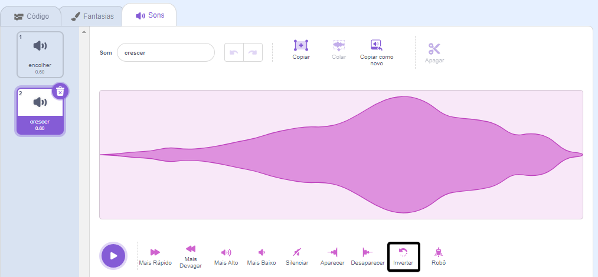
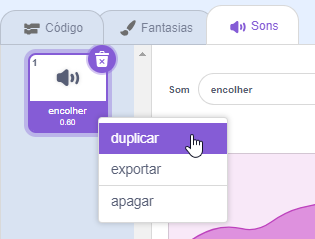

Inverter sons é útil para criar efeitos especiais, por exemplo, o som de `Apito deslizante` produz um bom efeito de encolhimento, portanto, invertê-lo cria o efeito de crescimento perfeito!

Adicione ou grave um som.

Clique no ícone **Inverter** para fazer o som ser reproduzido ao contrário. Você verá a onda sonora invertida.

**Dica:** Para manter a versão original e a versão invertida do som, clique com o botão direito (ou toque e segure) no som original e escolha "duplicar".

