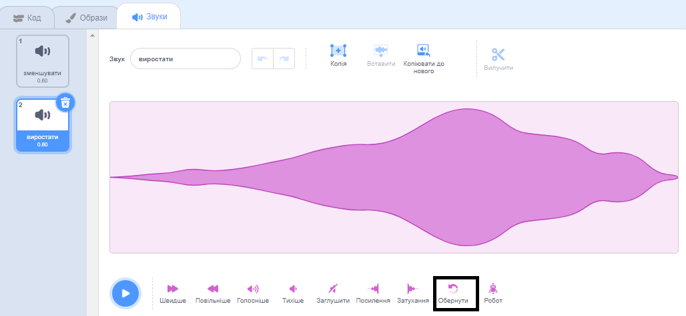
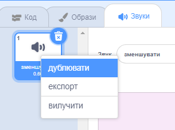

Обернені звуки корисні для створення спецефектів, наприклад, звук `Slide whistle` створює гарний ефект зменшення, тому його обернення дає ідеальний ефект збільшення!

Додати або записати звук.

Клацни на іконку **Обернути**, щоб звук відтворювався у зворотному напрямку. Ти побачиш, як звукова хвиля змінює напрямок.

**Порада:** Щоб зберегти як оригінальну версію, так і реверсну версію звуку, клацни правою кнопкою миші (або торкнись і утримуй) по оригінальному звуку і вибери ‘дублювати’.

